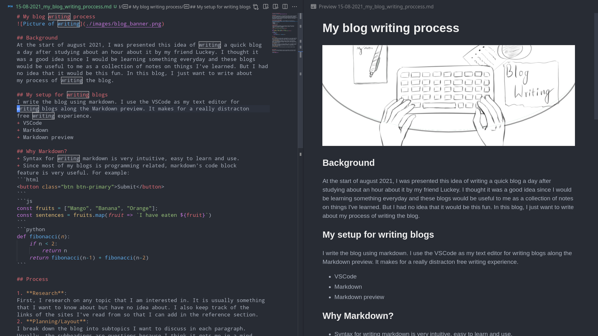

# My blog writing process


## Background
At the start of august 2021, I was presented this idea of writing a quick blog
a day after studying about an hour about it by my friend Luckey. I thought it
was a good idea since I would be learning something everyday and these blogs
would be useful to me as a collection of notes on things I've learned. But I had
no idea that it would be this fun. In this blog, I just want to write about
my process of writing the blog.

## My setup for writing blogs
I write the blog using markdown. I use the VSCode as my text editor for
writing blogs along the Markdown preview. It makes for a really distracton
free writing experience.
+ VSCode
+ Markdown
+ Markdown preview



## Why Markdown?
+ Syntax for writing markdown is very intuitive, easy to learn and use. 
+ Since most of my blogs is programming related, markdown's code block
feature is very useful. For example:
```html
<button class="btn btn-primary">Submit</button>
```
```js
const fruits = ["Mango", "Banana", "Orange"];
const sentences = fruits.map(fruit => `I have eaten ${fruit}`)
```
```python
def fibonacci(n):
    if n < 2:
        return n
    return fibonacci(n-1) + fibonacci(n-2)
```

## Process
1. **Research**:
First, I research on any topic that I am interested in. It is usually something that I want to know about but have no idea about. I also keep track of the links of the sites I've read from so that I can add in the reference section.
2. **Planning/Layout**:
I break down the blog into subtopics I want to discuss in each paragraph. Usually, the subheadings are questions because I think it gets me in a mind state to explain my thoughts to reader. I think that is a very important thing when writing tech blogs.
3. **Details**:
Now, I fill in the details of into each subtopic. After I've planned the whole thing, adding in the details into specific sub topic is a lot easier. I don't have to think about everything and my mind can focus on explaining this specific part of the blog.
4. **Final edits**:
And I try to read & re-read the blog and fix any thing that needs fixing.

## Conclusion
That is how I write my blogs and I find it very helpful to have this kind of structure. If you feel like this would be helpful to you too, give it a go.