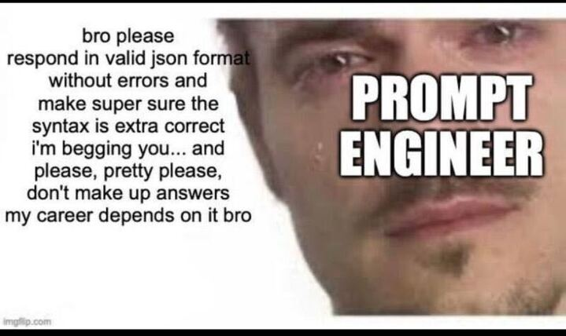
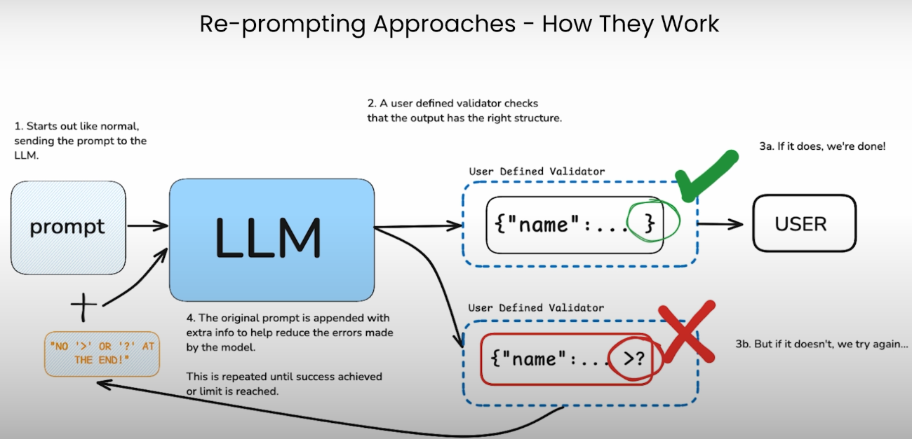
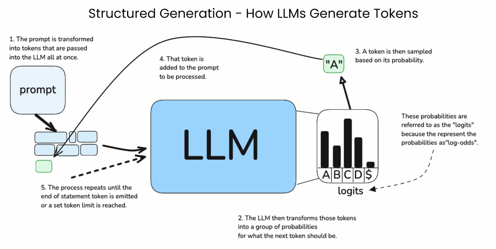

# Structured Outputs with Large Language Models (LLMs)

* Title: Structured Outputs with Large Language Models (LLMs)
* Presented by: Diwash Tamang

> A continuation to:



> Note to self: Run demo_0_prompt_hack.py
* Time estimation: 2 + 4 + 4 + 4 + 2: 16min


# Intro to structured Outputs
* Normally, responses from LLM are converstation texts.
    * It's easy for humans to understand.
    * It's really good to build chatbots, AI assitants for company/stores/etc.
        * Because it's meant to be used by Human.
    ```json
    [
        {"role": "user", "response": "You are the social media manager of our VIM blog page. Generate insightful tweets about VIM."}
        {"role": "ai", "response": "Vim is not just a tool. It’s a mindset: Precise, Efficient, Minimal & Intentional. Code like you mean it. Use Vim. #VimPhilosophy"}
    ]
    ```
* To build more complex software integrating AI & LLMs
    * We need our code (System & softwares) to interact with AI
    * Code interact with other code when they're using Protocols/Interfaces.
        * At the least we should have some structure.
        * Example: API Requests: payload has a structure, response has a structure.
            ```json
            Request POST
            Payload {"text": "Some txt ...", "model_names": ["YearsInBusiness"] }
            Response: {"status": 200, "body": [{"model": "YearsInBusiness", "output": 9}]}
            ```
        * We need structured outputs like Json, XML. JSON, XML, Tables, etc

>Note: We will be going through progressively better way of getting structured
>output in this presentation


# Example Use Case
* Get the names of business & subsidiaries from scraped content.
    1. Get the list of business urls
    2. Scrape the website (Home Page, About Us)
    3. Feed it too LLM & ask
    4. Parse the output response
    5. Save it to some database


# Option Zero: Hack Prompting
* Hack prompting example:
    ```
    <document>...scraped content here...</document>

    From the document above, please extract the business names & subsidaries.
    Make sure the response is a valid JSON object.

    {
        "business_name": "Some business Name",
        "subsidiaries": ["Subsidiary1", "Subsidiary2"]
    }
    ```
* Took multiple tries to just the format right.
* If json.loads fail, everything fails. :)
* Took multiple tries to get the answer correct. (80-90)
* Demo: With ChatGPT & Ollama

> Note to self: Run demo_1_prompt_hack.py


# Option One: Using proprietory LLM's API
* JSON Mode
    * Models that are fine tuned to output json
    * Activates some internal constraints that forces the model to output json
        * No explanation & preambles. No trailing characters. :)
        * Doesn't reliably matches the defined schema. :(
* Structured JSON APIs
    * Models that are fine tuned to output json
    * Activates some internal constraints that forces the model to output json
        * Follows a user defined structure (pydantic or zod)


> Note to self: Run demo_2_instructor.py (re-prompting example)


# Example code w/ openai python client (That I know works 😎 but can't do a demo. 😅)
```python
import openai

# INFO: JSON MODE Example
response = openai.ChatCompletion.create(
    model="gpt-4o-mini",
    messages=[
        {"role": "system", "content": "You are a helpful assistant."},
        {"role": "user", "content": "Give me an interesting character with name and age in JSON Format."}
    ],
    response_format={"type": "json_object"},  # 👈 this activates JSON mode
)
print(response.choices[0].message.content)

# INFO: Structured Outputs
from pydantic import BaseModel
from open_ai import OpenAI

class Business(BaseModel):
    name: str # name of the business
    subsidiaries: list[str] # list of subsidiary businesses
    # NOTE: it also supports nested classes (5 level of nesting)

client = OpenAI()
context = "...scraped content..."
response = client.beta.chat.completions.create(
    model="gpt-4o-mini",
    messages=[
        "role": "user",
        "content": [
            { "type": "text", "text": f"<document>{context}</document>" },
            { "type": "text", "text": question },
        ]
    ],
    response_format=Business,
)
print(response.choice[0].message.parsed)
```


## Demo with ollama
* json mode in ollama
* released recently
* had to update the ollama docker image


## Pros & Cons of using Proprietary Structured Outputs
* Pros:
    * Easy to use if already using OpenAI or Anthropic
    * Continually improving
* Cons:
    * Refactoring when changing from one Vendor to Another
    * Lack of control


# Option Two: Re-prompting
* Principle:
    * Ask LLM to return json (that follows schema in pydantic or zod)
    * Valide it with pydantic or zod
    * Case 1: No error
        * Success
        * Return output
    * Case 2: Error
        * error message + initial prompt to LLM again
        * Repeat until success
* Frameworks:
    * instructor
    * langchain




## Demo with Instructor
* DEMO with Instructor

> Note to self: Run demo_3_outlines.py (Structured Generation)


## Pros & Cons
* Pros:
    * More control over output & no vendor lockin
    * More specific outputs with regex (like valid email & formatted phone number, etc)
* Cons:
    * Time consuming (Multiple Attempts)
    * Money consuming (Multiple Attempts, More token used)
    * Chance of failing


## Option Three: Structured Generation (aka Constrained Decoding)
* Uses logits based approach
    > Logits represent the raw, unnormalized scores produced by the last layer of
    > a neural network before these scores are transformed into probabilities.

* Brief overvew of LLMs work
    * Messages History/Prompts Feed into LLM
        * LLM gets a list of probable next token
            * Example: I am harry
                * next token logits: 
                    1. potter 90%
                    2. lamsal 2%
                    3. tamang 0.1%
                    ...
        * Repeatedly keeps generating token until a meaning output is reached.
* Outlines hacks in to the final layer of the model & baises the selection of next token.
    * Example:
        * Question: Give the business information in json output.
        * next token logits:
            1. `Here` 32%
            2. `Of course` 31% (these are tokens)
            3. `{` (28%) (Models fine tuned for json will automatically have this as the highest probablity)
            ...
        * No 3 is selected because of the baised selection that outlines enforces
        * This is done continually until a valid json is formed.


## Demo with outlines
* Business Info
* Character Generation
* Tool calling


## Pros & Cons of Structured Generation
* Pros:
    * No overhead (unlike instructor)
    * Fast
    * Lightweight (Excluding the size of the model used.)
    * Valid format is ensured even in very small models
    * 95 % correct syntax (which is very high)
    * Can work with regex & not only jsons.
        * yamls, csvs, etc
    * We can also use context-free grammer to generate output (using regex)
        * context-free grammers are used by compilers to analyze code
* Cons:
    * Requires control over the model
        * Open models
        * Your own proprietory model


# Conclusion from trials
* Structured Output is a must for software integration.
* Structure is not always ensured even with outlines in case of complex regex matching.
    * Reason 1: Model is not good
    * Reason 2: Context is not good
    * Reason 3: Impossible condition.
        * Example:
            1. Extract email from scraped content.
            2. Content: "My name is Hari Bahadur Chyangba" (content has no email.)
            3. Don't hallucinate
        * No way of matching a valid email now.
        ```
        ________________________________________
        | WHATT??? json.encode.JSONEncodeError |
        ========================================
                           \
                           \
                               ^__^ (Instructor & Outline)
                               (oo)\_______
                               (__)\       )\/\
                                   ||----w |
                                   ||     ||
        ```


## References:
* [Structured LLM Output Course on learn.deeplearning.ai](https://learn.deeplearning.ai/courses/getting-structured-llm-output)
    * Highly recommend to check this out.
    * It's a free course on SO.
    * An hour of pure raw knowledge. (Video tutorial + Lab)
* [Outlines GitHub Page](https://github.com/dottxt-ai/outlines)
* [Outlines Webpage](https://dottxt-ai.github.io/outlines/latest/welcome/)
* [Harnessing Structured total w/ Ollama & Instructor](https://python.useinstructor.com/examples/ollama/)
* [Ian Wootten - Ollama Structured Outputs](https://www.youtube.com/watch?v=3ZJ0N937Jhw)
* [Remi Louf's talk on AI Engineer](https://www.youtube.com/watch?v=aNmfvN6S_n4)
    * Co-author & Co-maintainer of outlines
    * CEO & Co-founder of [dottxt](https://dottxt.co/)


## Any Questions?
```
      _______________________
    | ANY QUESTIONS, FRIENDS? |
      =======================
                  \
                   \
    ⠀⠀⠀⠀⠀⠀⠀⠀⠀⠀⠀⠀⠀⠀⠀⠀\⠀⠀⢀⣴⣶⠀⢀⣴⣶⡄⠀⠀⠀
    ⠀⠀⠀⠀⠀⠀⠀⠀⠀⠀⠀⠀⠀⠀⠀⠀⠀\⠀⢸⣞⣿⢠⡟⣿⣿⠇⠀⠀⠀
    ⠀⠀⠀⠀⠀⠀⠀⠀⠀⠀⠀⠀⠀⠀⠀⠀⣀⣀⣀⣨⣿⣿⣼⣿⣟⠏⠀⠀⠀⠀
    ⠀⠀⠀⠀⠀⠀⠀⢀⣀⣠⣤⣤⠶⠶⣿⣿⣿⢛⣿⣿⣿⣷⡟⠏⠿⡄⠀⠀⠀⠀
    ⠀⣀⣠⣤⣤⣼⣿⣟⢛⠠⡀⢄⡸⠄⣿⢿⣿⣇⣼⢿⣿⣟⠣⡘⠸⢿⠀⠀⠀⠀
    ⣸⣿⣿⣿⣿⣿⣿⣿⡌⠱⣈⠒⡄⢣⠘⠾⠟⡠⠘⠞⡿⢋⠔⢡⠃⣿⡆⠀⠀⠀
    ⣿⣿⣿⣿⣿⣿⣿⣿⡇⠡⠄⢃⠌⠄⢣⠘⠤⡁⢍⠒⡐⠌⣂⠦⣉⣿⡇⠀⠀⠀
    ⢿⣿⣿⣿⣿⣿⣿⣿⡇⢡⠊⠔⡨⠘⢄⠊⡔⢁⠊⡔⢁⠎⣐⠺⢅⣾⡇⠀⠀⠀
    ⠘⣿⣿⣿⣿⣿⣿⣿⠃⡐⠌⡂⠥⢑⡈⢒⠨⠄⡃⢄⢃⢎⡱⢃⠎⣾⠇⠀⠀⠀
    ⠀⠈⠛⢿⣿⣿⡿⠋⡐⢀⠢⢡⠘⡠⠘⡄⢃⣜⣠⣮⡿⠷⡂⢍⢂⣿⠀⠀⠀⠀
    ⠀⠀⠀⠀⠈⠙⠓⠶⠶⠤⢾⣄⠂⡱⣌⡜⣻⣋⣯⡕⡘⠤⡑⢪⡰⣿⠀⠀⠀⠀
    ⠀⠀⠀⠀⠀⠀⠀⠀⠀⠀⠀⣿⣶⣤⣔⣸⣨⣍⣍⣱⣬⣶⣽⣶⡿⠟⠢⡄⠀⠀
    ⠀⠀⠀⠀⠀⠀⠀⠀⠀⠀⡼⡷⠈⠙⠛⠿⠯⠽⠿⠿⠟⠛⠋⠉⣄⣇⠀⠹⡄⠀
    ⠀⠀⠀⠀⠀⠀⠀⠀⠀⢰⢃⡇⠁⠀⠀⠀⠀⠀⠀⠀⠀⠀⠀⠀⣿⠀⠄⠀⣹⡄
    ⠀⠀⠀⠀⠀⠀⠀⠀⠀⢿⠻⡇⠀⠀⠀⠀⠀⠀⠀⠀⠀⠀⠀⠀⣿⣶⣾⠃⠘⡇
    ⠀⠀⠀⠀⠀⠀⠀⠀⠀⠘⣆⣿⣄⣀⡀⠀⠀⠀⠀⠀⠀⠀⠀⣴⡏⠀⠀⠀⣼⠇
    ⠀⠀⠀⠀⠀⠀⠀⠀⠀⠀⠈⢿⡉⠻⣿⣿⣿⣿⣿⣿⣿⣿⠿⠛⣷⣤⣀⣼⠏⠀
    ⠀⠀⠀⠀⠀⠀⠀⠀⠀⠀⠀⠈⡇⠀⠘⠿⢿⣿⣯⣽⣻⠟⠁⠐⢤⡯⢙⣿⠀⠀
    ⠀⠀⠀⠀⠀⠀⠀⠀⠀⠀⠀⠀⢹⠀⠀⠀⠀⠘⣿⠀⠀⠀⠀⠀⠀⠀⢸⣿⠀⠀
    ⠀⠀⠀⠀⠀⠀⠀⠀⠀⠀⠀⠀⠘⡆⠲⢶⣄⠀⢻⡆⠀⣤⣀⠀⠀⠀⢸⣿⠀⠀
    ⠀⠀⠀⠀⠀⠀⠀⠀⠀⠀⠀⠀⢠⣽⡄⠀⠀⠀⠘⣿⠀⠈⠛⠃⠀⠀⢸⣿⠀⠀
```


## Some Notes:
* Initially planned to use out deepseek-r1 demo (Which was said to be a relatively smaller model)
    * 43 tensor files: each file was 4GB (:
    * Around 170 GB
    * There are distil models available though:
        * deepseek-ai/DeepSeek-R1-Distill-Llama-8B: Around 8 GB
        * You can try it out.
        > What is "Distillation"? Distillation is a model compression technique
        > where a smaller "student" model is trained to replicate the behavior
        > of a larger "teacher" model. The goal is to make the model faster and
        > more efficient while retaining much of the original performance.
        * I am not doing it because of time constraints
        * Some papers suggests that distil models outperform the larger counterpart by a small margin.
* Model Name suffixes & their Meaning:
    * Base:
        + Plain LLM (llama, llama2)
    * `-Instruct/-Chat`:
        + Fine-tuned for instruction following or chat.
    * `-Code`:
        + Fine tuned for instruction following or chat
    * `-VL`:
        * Multimodal with vision + text
        * Eg: Qwen-VL
    * `-Omni`:
        * Designed for multimodel + multilingual and general purpose use
        * Eg: GPT-4 Omni, Qwen-Omni
    * `MoE`:
        * Mixture of experts
        * Routers routes the input to specialized subsection of experts
        * Faster to train & Faster to inference
        * Don't understand it completely to be honest.
    * `Tiny / Small / Medium / Large / XL / 7B / 70B`
        * Denotes the size
    * `Distill`
        * Smaller student models trained using a larger teacher model.


## Feed Back
* Any thing that needs to be improved?
* Did I overexplain or underexplain anything?
* Anything that you would have wanted to see.
* Was the presentation too lengthy?


# Thank you for listening

⠀⠀⠀⠀⠀⠀⠀⠀⠀⠀⠀⠀⠀⠀⠀⠀⠀⠀⢀⣀⣀⣀⣀⠀⠀⠀⢀⡤⠤⠤⣄⠀⣀⣀⡀
⠀⠀⠀⠀⠀⠀⠀⠀⣀⣀⠤⢴⣴⠒⠉⠹⣴⣏⠀⠀⠀⡀⠈⢇⠀⠀⣼⠀⠀⠀⠘⣶⠇⠀⢨⢃⡾⠓⠲⢤
⠀⠀⠀⣀⠤⠔⠒⠙⣯⣇⠀⠈⣿⣇⠀⠀⣿⣿⣿⠀⠀⣷⠀⠘⡄⠀⣿⠀⠀⠀⠀⢹⠀⠀⢸⡏⠇⠀⢀⠇⣀⠤⠒⠒⠤⣄
⢰⡖⠉⠀⠀⠀⠀⣀⣸⣿⠀⠀⠉⠉⠀⠀⢸⠁⣿⠀⠈⠉⠁⠀⢱⠀⣿⠀⠀⣦⠀⠀⠀⠀⣿⡸⠀⠀⠘⠉⠀⠀⣀⣤⣴⠟
⢼⢣⣀⣴⡀⠀⠘⡿⠏⠗⡆⠀⠠⣶⡆⠀⠸⡄⡏⠀⠀⣶⣷⠀⠀⢧⣿⠀⠀⣿⡆⠀⠀⢸⣿⠃⠀⢰⡄⠀⠐⡿⠛⠋
⠘⢿⡿⢿⣧⠀⠀⢳⠀⢸⠸⠀⠀⢹⣧⢀⣀⣷⣧⣤⣤⠛⣏⣦⣤⣾⣿⢦⣤⣿⢸⣄⣀⣼⡏⠀⢠⡟⡇⠀⠀⡇
⠀⠀⠀⠀⢏⢇⠀⠀⣣⠀⣆⣷⣶⣿⣿⡿⠿⠿⢷⡿⠟⣠⠟⠋⠛⢿⡛⠛⠿⡼⠿⠿⢿⣿⣿⣶⠞⡅⢸⠀⠀⢸⠀
⠀⠀⠀⠀⠘⣾⣿⣿⠇⢠⣟⠉⠙⠷⡿⠀⠀⠀⢸⢀⡼⠁⠀⣀⠀⠀⠹⡄⡼⡇⠀⠀⡜⣸⡏⠙⠢⣧⣾⣦⣀⢸
⠀⠀⠀⠀⠀⠈⠀⠀⠀⢿⣿⣷⣦⡀⠀⠀⠀⠀⣇⡾⠀⠀⣼⣿⢷⠀⠀⢻⢱⠀⠀⢀⣿⡿⠀⠀⢠⠋⢻⡿⠿⣏
⠀⠀⠀⠀⠀⠀⠀⠀⠀⠀⠈⠳⣿⣿⠆⠀⠀⢸⡏⡇⠀⠀⡏⡟⡟⠀⠀⢸⡸⠀⠀⢸⣿⠃⠀⠀⡜⡰⢩⠃⠀⠈⣱⠀
⠀⠀⠀⠀⠀⠀⠀⠀⠀⠀⠀⠀⢸⢹⠀⠀⠀⢸⠀⡇⠀⠀⠙⠋⠀⠀⢀⡏⡇⠀⠀⠘⠋⠀⠀⣰⣱⢣⠇⠀⠀⣰⠃
⠀⠀⠀⠀⠀⠀⠀⠀⠀⠀⠀⠀⡘⡎⠀⠀⠀⡏⣿⣧⡀⠀⠀⠀⠀⢀⣾⣷⡇⠀⠀⠀⠀⠀⢠⣯⣧⣾⣦⣄⣰⠃
⠀⠀⠀⠀⠀⠀⠀⠀⠀⠀⠀⠀⣧⣧⣤⣶⣶⠃⠘⢿⣿⣷⣶⣶⣾⠟⠉⣿⣿⣦⣄⣀⣠⣴⢏⣽⠋⠉⠙⢿⠁
⠀⠀⠀⠀⠀⠀⠀⠀⠀⠀⠀⠘⠛⠛⠛⠋⠁⠀⠀⠀⠉⠉⠉⠉⠀⠀⠀⠈⠛⠻⠿⠟⠋⠁⣿⣿⣦⣀⣀⡼
⠀⠀⠀⠀⠀⠀⠀⠀⠀⠀⠀⠀⠀⠀⠀⠀⠀⠀⠀⠀⠀⠀⠀⠀⠀⠀⠀⠀⠀⠀⠀⠀⠀⠀⠙⠛⠛⠛⠁


