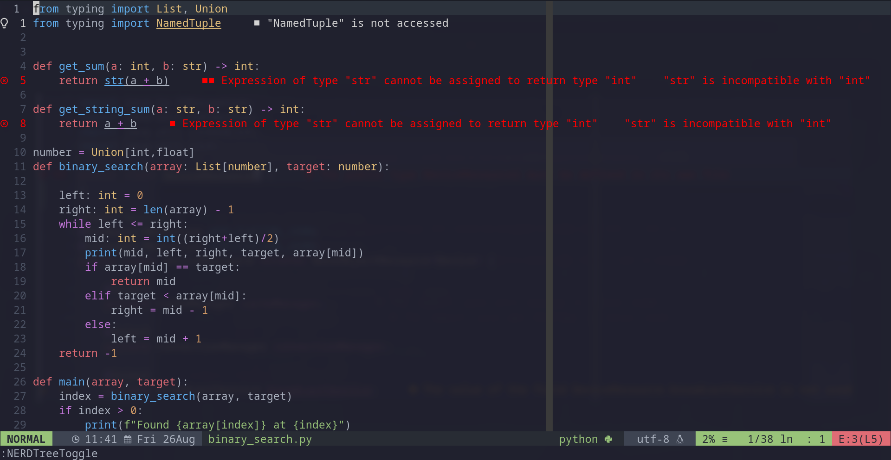

Date: 25-08-2022
# Setting up LSP Config in Neovim

## What is LSP?

>Language Server Protocol (LSP) is a protocol of communication between
>IDEs/code editors and *servers* that provide programming language specific
>features like code completion, refactoring(renaming variables) or navigating
>to a symbol's definition, etc.

## The problem that LSP solves
There are many code editors like vim, VSCode, Atom, PyCharm, etc. And there are
things we expect from IDEs: features like code completion, navigating to
definition, etc for each language. Before LSP was around, each IDE/code editor
needed to add it's own implementation of the language specific features. Most
languages were tied to a given IDE or editor. If a new editor was developed, it
needed to implement features like renaming variable or displaying squiggly
lines for a possible error for every language. If a new language came around,
it was difficult for it to be supported by all existing editors.

Now, that we have Language Server protocol, we have two agents: an editor
(client) and a language server (server). The server provides language specific
features like features like go-to-definition, find-references, hover,
completion, rename, format, refactor, etc., using semantic whole-project
analysis. The client or the editor does the following:
    * Communicate with server about capabilities (e.g. Can client & server do snippets?)
    * Sends requests and handles responses (e.g. When programmer ctrl-clicks on
      a symbol in a python file, client asks pyright to find the file and line
      number of the definition of the symbol is, and after pyright responds
      the editor takes you to the definition. Go-to-definition done)
    * Handles notifications sent by server (e.g. Error Diagnostics: show you
      squiggly lines under the codes that have errors or warnings)
And all of these communication is done following the Language Server Protocol.
So, any new editor can make use of any sophisticated language server. And any
programmer involved with the development of a new programming language can make
services for that language available to existing editors. This is the reason
Neovim can use the VSCode's language server (coc) because they both support LSP.
 
> LSP was initially developed by Microsoft for VSCode and is now a open standard

## Now that we know a bit about how LSP works, let's get to setting up LSP configuration for Neovim.
These can be divided into three parts:
* Install nvim-lspconfig
* Install the language server on your PATH
* Tell Neovim to use the language server

### Install nvim-lspconfig
First, we need to install nvim-lspconfig plugin which provides configurations
for the Nvim LSP client. According to *TJ Devries*, you don't technically
need this plugin since Neovim has built in LSP client, but it helps you manage
and connect to the LSP server a bit more easily. It provides configurations for
different language servers to make it easier to attach and manage them.

To install using VimPlug,
* add the `Plug 'neovim/nvim-lspcnofig'` to your vimrc
  ```vim
  call plug#begin('~/.config/nvim/plugged')
  ...
  Plug 'neovim/nvim-lspconfig' " Configuration for Nvim LSP
  ...
  call plug#end()
  ```
* Restart vim or source your vimrc with `source %`
* Type in `:PlugInstall` command and that will install the nvim-lspconfig.

### Install the language server on your PATH
Since I work with python, typescript and dabbling into Java. I will set up LSP for those.
* Install pyright LSP server for python.
  ```sh
  npm install -g pyright
  ```
* Install typescript-language-server for typescript
  ```sh
  npm install -g typescript typescript-language-server
  ```
* Install Eclipse JDT language server for java
  ```sh
  yay -S jdtls
  ```
  Note: I am using yay to install jdtls. Click
  [here](https://github.com/eclipse/eclipse.jdt.ls) to learn more about installing
  the eclipse jdtls.

### Tell Neovim to use the language server
Lastly, you have to specify the key maps that you want for the type of functionality
provided by the LSP  and attach them to each of the language server in your vimrc
file.
* In you vimrc, add the following code
```vim
lua << EOF
-- Mappings.
local opts = { noremap=true, silent=true }

-- Use an on_attach function to only map the following keys
-- after the language server attaches to the current buffer
local on_attach = function(client, bufnr)
    -- Enable completion triggered by <c-x><c-o>
    vim.api.nvim_buf_set_option(bufnr, 'omnifunc', 'v:lua.vim.lsp.omnifunc')

    local bufopts = { noremap=true, silent=true, buffer=bufnr }
    vim.keymap.set('n', 'K', vim.lsp.buf.hover, bufopts)
    vim.keymap.set('n', 'gd', vim.lsp.buf.definition, bufopts)
    vim.keymap.set('n', 'gi', vim.lsp.buf.implementation, bufopts)
    vim.keymap.set('n', 'gr', vim.lsp.buf.references, bufopts)
    vim.keymap.set('n', 'gD', vim.lsp.buf.declaration, bufopts)
    vim.keymap.set('n', '<space>K', vim.lsp.buf.signature_help, bufopts)
    vim.keymap.set('n', 'gt', vim.lsp.buf.type_definition, bufopts)
    vim.keymap.set('n', '<F2>', vim.lsp.buf.rename, bufopts)
    vim.keymap.set('n', '<space>rn', vim.lsp.buf.rename, bufopts)
    vim.keymap.set('n', '<space>ca', vim.lsp.buf.code_action, bufopts)
    vim.keymap.set('n', '<space>f', vim.lsp.buf.formatting, bufopts)
    vim.keymap.set('n', '<space>e', vim.diagnostic.open_float, opts)
    vim.keymap.set('n', '[d', vim.diagnostic.goto_prev, opts)
    vim.keymap.set('n', ']d', vim.diagnostic.goto_next, opts)
end

-- this part is telling Neovim to use the lsp server
local servers = { 'pyright', 'tsserver', 'jdtls' }
for _, lsp in pairs(servers) do
    require('lspconfig')[lsp].setup {
        on_attach = on_attach,
        flags = {
          debounce_text_changes = 150,
        }
    }
end

-- this is for diagnositcs signs on the line number column
-- use this to beautify the plain E W signs to more fun ones
local signs = { Error = " ", Warn = " ", Hint = " ", Info = " " } 
for type, icon in pairs(signs) do
    local hl = "DiagnosticSign" .. type
    vim.fn.sign_define(hl, { text = icon, texthl= hl, numhl = hl })
end
EOF
```

## The results
Now you can go to a python or typescript or a java project. Yay 🎉🎉🎉





### Notes
* IMPORTANT! Not triggering root detection. Some language servers will only start if it is
  opened in a directory, or child directory, containing a file which signals
  the root of the project. Most of the time, this is a .git folder, but each
  server defines the root config in the lua file. See
  [server_configurations](https://github.com/neovim/nvim-lspconfig/blob/master/doc/server_configurations.md)
  or the source for the list of root directories.
* Use `:help lsp` to help with setting up lsp config and learn more about it.
